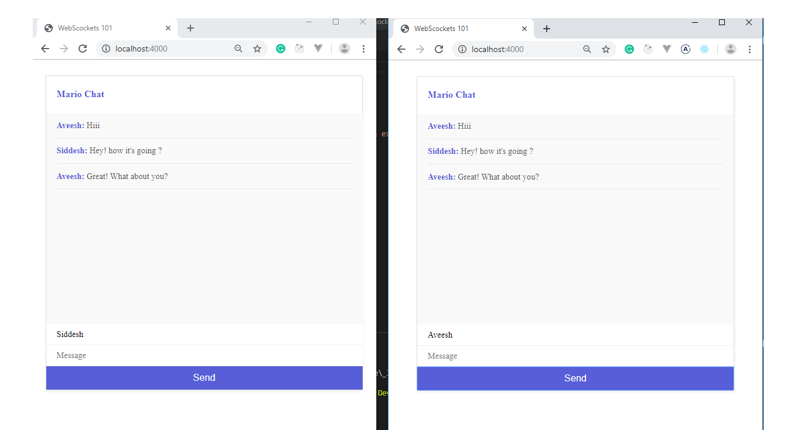

# Chat app
> A Realtime chat app using Nodejs and websocket.io



## Quick Start

```bash
# Install dependencies
npm install

# Serve on localhost:3000
npm start

# Build for production
npm run build
```

## App Info

### Author

Brad Traversy
[Aveesh Shetty]

### Version

1.0.0

### License

This project is licensed under the MIT License

